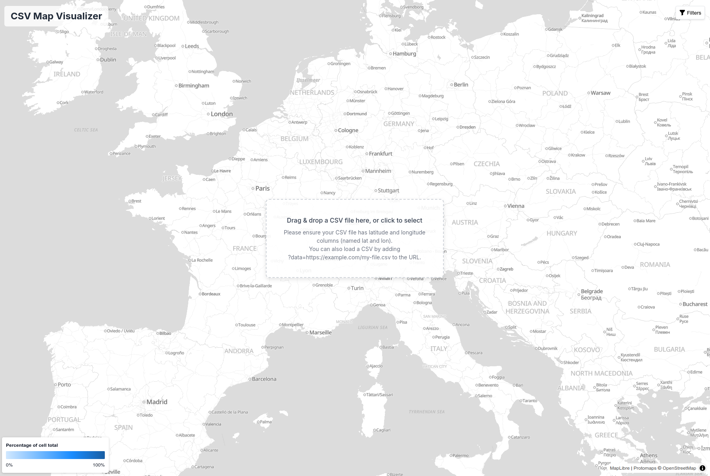
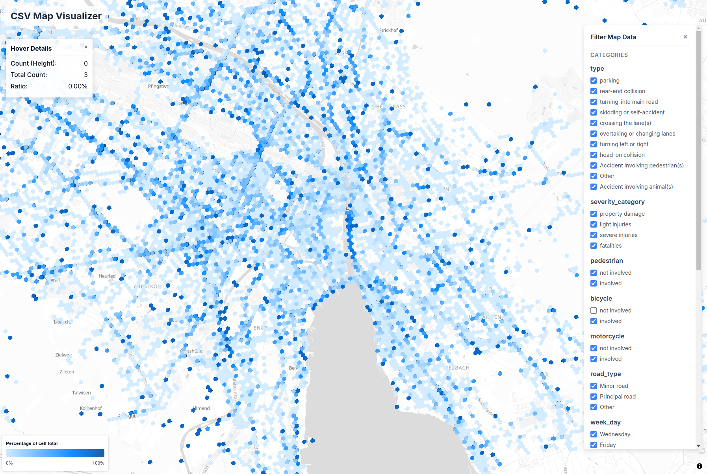

# csv-map-visualizer

Visualize CSV data on a map.

## usage

Go to https://wipfli.github.io/csv-map-visualizer/, drag and drop your CSV file, start analyzing.

Your CSV file needs to provide latitude and longitude in columns called `lat` and `lon`.

If a column contains text values, those will show up as "Categories". If a column has numeric values, it will show up in the "Numeric Ranges" filter panel. You can filter by text categories and numeric values.

## demo

The city of Zürich publishes accident reports since 2011 as open-data. In the demo below we visualize this data. The screenshot shows bicyle accidents. 

Data: https://data.stadt-zuerich.ch/dataset/sid_dav_strassenverkehrsunfallorte (CC-BY)

https://wipfli.github.io/csv-map-visualizer/?data=https://pub-cf7f11e26ace447db8f7215b61ac0eae.r2.dev/zurich-accident-reports-2011-to-2025.csv

## technology

Uses DuckDB Wasm in the browser to analyze your CSV. No data is sent to a server.
